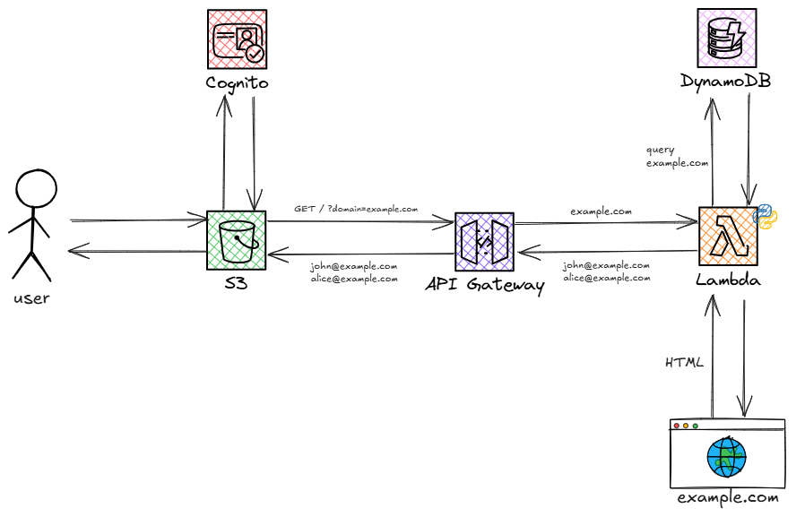

  

  <b>Email Extractor</b> is a web-based tool that extracts email addresses from a given URL.

 

## 📋 Usage 

1. Go to https://emailextractorbucket.s3.eu-north-1.amazonaws.com/index.html
2. Log in with the credentials from the resume.
3. Enter any URL you want to scan.

## 💼 What I Built  
This project demonstrates a serverless application on AWS. Key components include:

- 🔐 **Authentication**: Implemented secure user login with AWS Cognito.
- 🌐 **Hosting**: Deployed a static site on S3 with public access configuration.
- ⚙️ **Backend Logic**: Built a Python Lambda function triggered by API Gateway to parse the HTML content from a given URL and extract email addresses recursively (up to two layers).
- 💾 **Caching**: Integrated DynamoDB to store and reuse results for repeated queries.
- ❗ **Error Handling**: Handled edge cases like invalid URLs, pages without emails, and duplicate results.
  

## 🔄 Workflow  

This project uses a GitHub Actions workflow to deploy updates automatically.

- When code is pushed to the `main` branch, the updated Lambda function is automatically packaged and deployed to AWS.
  
## 🌱 Reflection

🌼 This project was my first attempt at building a cloud-based application, and a valuable learning experience.
It helped me understand the basics of serverless architecture and how different AWS services work together.
I'm looking forward to learning more and exploring new technologies.

